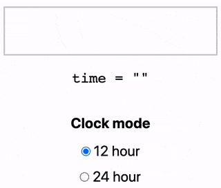

# react-simple-time-input

A simple time input that accepts times in flexible format. It has support for both 12- and 24-hour format.

[**View live demo**](https://citifyd.github.io/react-simple-time-input/)



## Installation

`npm install react-simple-time-input --save`

## Usage

```jsx
import React, { useState } from 'react'
import SimpleTimeInput from 'react-simple-time-input'

function MyComponent () {
  const [time, setTime] = useState('14:00')

  const valueChanged = newValue => {
    setTime(newValue)
    alert(`Time changed to ${newValue}`)
  }

  return (
    <SimpleTimeInput
      value={time}
      clockMode={12}
      onValueChange={valueChanged} // called on blur
    />
  )
}
```

By default, it will append an `invalid-time` class to the input if the user is typing a time in invalid format. You can set your own invalid class name by passing a `invalidClassName` prop.